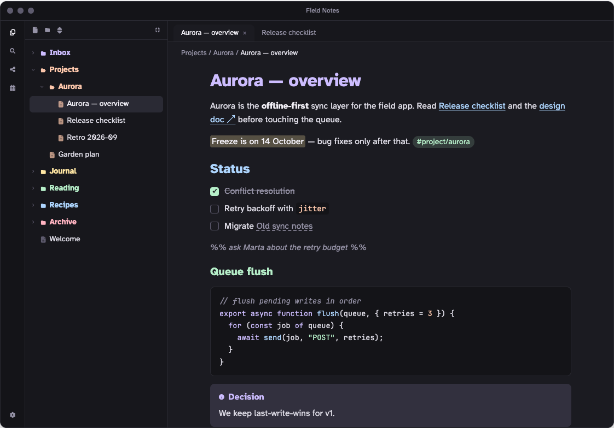
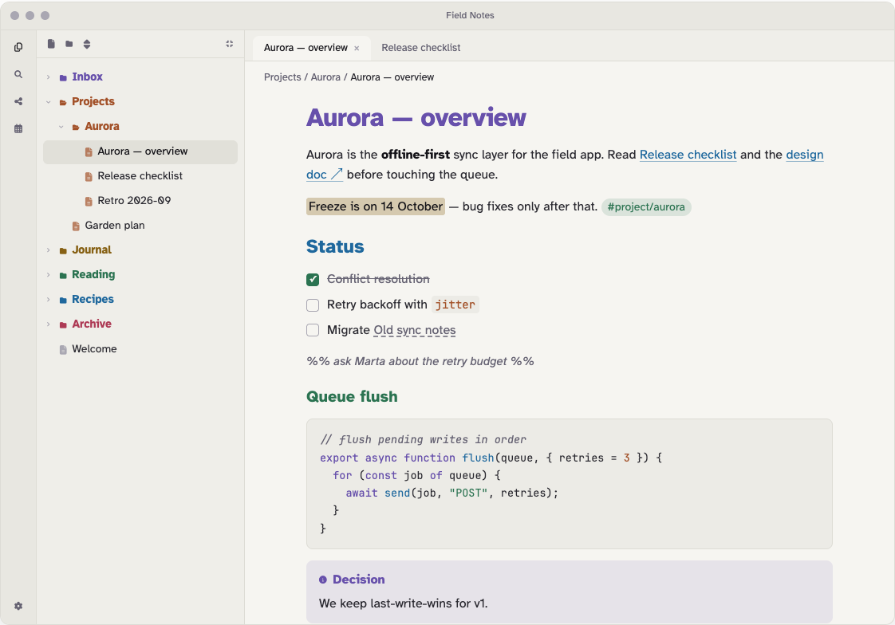

# Pastello

A soft pastel theme for [Obsidian](https://obsidian.md), in light and dark, made for long reading sessions.





*Screenshots show the **Colorful by position** folder option; with the default, **Colorful by name**, folder hues follow their names instead.*

- **Easy on the eyes.** Soft charcoal and warm paper backgrounds instead of pure black or white, the hyper-legible Atkinson Hyperlegible typeface, and a relaxed 1.6 line height.
- **Every element is distinct.** Headings, links, tags, inline code, code syntax and comments each get their own hue *and* their own shape (size, weight, italic, underline, pill), so color is never the only cue.
- **Colored folders.** Each top-level folder in the file explorer gets one of six pastel hues (lavender, peach, butter, mint, sky, rose), picked from its name, and everything inside inherits it.
- **Readable in both modes.** Body text, muted text and all six hues reach at least 4.5:1 contrast (WCAG AA) on the note background, in light and dark.
- **Desktop and mobile.** Touch-sized file tree rows (44px), mobile heading sizes, and code blocks that scroll instead of wrapping on phones.

## Install

**From Obsidian:** open **Settings → Appearance → Themes → Manage**, search for **Pastello**, then select **Install and use**.

**Manually:** download `manifest.json` and `theme.css` from the [latest release](https://github.com/raccoon-overlord-dev/obsidian-pastello-theme/releases/latest), put them in `<your vault>/.obsidian/themes/Pastello/`, and choose Pastello under **Settings → Appearance → Themes**.

Pastello needs Obsidian 1.5.0 or later.

## Options

Pastello works without any plugin. To change the file explorer style, install the [Style Settings](https://github.com/mgmeyers/obsidian-style-settings) plugin and open **Settings → Style Settings → Pastello**:

| Setting | Options | Default |
| --- | --- | --- |
| **Folder colors** | **Colorful by name**: each top-level folder gets a hue from the first letter or digit of its name. **Colorful by position**: hues cycle in order down the list. **Monochrome**: neutral folders. | Colorful by name |
| **Colored folder style** | **Colored text**: folder names in their hue. **Tinted row**: a soft tinted row with neutral names. Has no effect in Monochrome. | Colored text |

**Colorful by name** keeps every folder's hue fixed, even while scrolling a long tree. Letters and digits map to hues in order (a, g, m, s, y and 0, 6 are lavender; b, h, n, t, z and 1, 7 are peach; and so on), so an alphabetically sorted list still cycles through the colors. For names like `01 Inbox`, `02 Projects` the second digit counts, so they differ too. Two neighbors with the same first letter share a hue, and names starting with an emoji or a non-Latin letter stay neutral.

**Colorful by position** spreads the hues best (no two neighbors match), but see the known limitation below about long trees.

To pick a folder's hue yourself, add a [CSS snippet](https://help.obsidian.md/snippets) with a rule like this one, using the folder's name and one of `lavender`, `peach`, `butter`, `mint`, `sky`, `rose`:

```css
.nav-files-container :is([data-path="Work"], [data-path^="Work/"]) { --pf: var(--pastello-mint); }
```

The accent color (buttons, selection, the mobile "+" button) is lavender by default and follows Obsidian's **Settings → Appearance → Accent color** if you pick one. Headings, links, tags and code keep their pastel colors.

## Fonts

Text uses **Atkinson Hyperlegible** (regular, italic and bold), which is bundled with the theme, so nothing is downloaded. Bold italic is not bundled, to keep the theme small; the browser slants the bold instead. Code uses **JetBrains Mono** if you have it installed, or your own monospace font if you've set one under **Settings → Appearance → Font**, then the system default.

## Known limitations

- **Colorful by position in very long file trees.** This option assigns hues by position among the top-level folders. To stay fast, Obsidian removes rows that are scrolled far out of view, and folders that aren't on the page don't count. So in a long tree a folder's hue can change while you scroll. Small and medium vaults aren't affected. The default, **Colorful by name**, doesn't have this problem.
- **Code block scrolling on mobile** works in Reading view. In Live Preview and Source mode, code lines follow the editor's line-wrapping setting.
- **The accent-tinted "+" button** in the mobile bottom bar needs Obsidian 1.12 or later; older versions show the default button.

## Development

`src/theme.css` is the source. The `theme.css` at the repository root is generated from it with the fonts and icons embedded, so don't edit it directly. Both scripts need only Python 3.8+ with no dependencies.

```sh
python3 build.py      # build theme.css from src/theme.css, fonts/ and icons/
python3 contrast.py   # check WCAG contrast of the color tokens (fails below 4.5:1)
```

The community directory reviews themes with [`stylelint-config-obsidianmd`](https://www.npmjs.com/package/stylelint-config-obsidianmd). To run the same checks locally (needs Node 22+), install them in a scratch folder outside the repo:

```sh
REPO="$PWD"
mkdir -p /tmp/pastello-lint && cd /tmp/pastello-lint
npm install --no-save stylelint@17 stylelint-config-obsidianmd
echo '{"extends":"stylelint-config-obsidianmd"}' > .stylelintrc.json
npx stylelint "$REPO/theme.css" --config .stylelintrc.json
cd "$REPO"
```

Only its **warnings** matter for the review; the formatting errors it also prints come from `stylelint-config-standard` and are ignored there. Keep `theme.css` under about 100 KB.

**Releasing:** bump `version` in `manifest.json`, rebuild, commit, then create a GitHub release whose tag is exactly that version (for example `1.0.3`, no `v`) and attach `manifest.json` and `theme.css`.

`test-vault/README.md` explains how to set up a test vault with the theme linked in.

## Credits and licenses

- Pastello theme: [MIT](LICENSE), © raccoon-overlord-dev.
- [Atkinson Hyperlegible](https://github.com/googlefonts/atkinson-hyperlegible) by the Braille Institute of America, embedded under the [SIL Open Font License 1.1](fonts/OFL.txt). The embedded copies have their hinting removed to keep the theme small; all characters are kept.
- Folder and file icons from [Lucide](https://lucide.dev) (`folder`, `folder-open`, `file-text`), embedded as a three-icon subset of the Lucide icon font, [ISC License](icons/LICENSE).
- Six-hue palette adapted from a pastel Starship prompt preset ("2a colorful").
