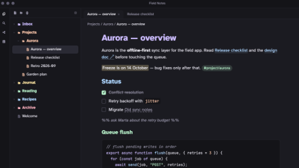

# Pastello

A soft pastel theme for [Obsidian](https://obsidian.md), in light and dark, made for long reading sessions.



- **Easy on the eyes.** Soft charcoal and warm paper backgrounds instead of pure black or white, the hyper-legible Atkinson Hyperlegible typeface, and a relaxed 1.6 line height.
- **Every element is distinct.** Headings, links, tags, inline code, code syntax and comments each get their own hue *and* their own shape (size, weight, italic, underline, pill), so color is never the only cue.
- **Colored folders.** Each top-level folder in the file explorer gets one of six pastel hues (lavender, peach, butter, mint, sky, rose), and everything inside inherits it.
- **Readable in both modes.** Body text, muted text and all six hues reach at least 4.5:1 contrast (WCAG AA) on the note background, in light and dark.
- **Desktop and mobile.** Touch-sized file tree rows (44px), mobile heading sizes, and code blocks that scroll instead of wrapping on phones.

## Install

**From Obsidian:** open **Settings → Appearance → Themes → Manage**, search for **Pastello**, then select **Install and use**.

**Manually:** download `manifest.json` and `theme.css` from the [latest release](https://github.com/raccoon-overlord-dev/obsidian-pastello-theme/releases/latest), put them in `<your vault>/.obsidian/themes/Pastello/`, and choose Pastello under **Settings → Appearance → Themes**.

Pastello needs Obsidian 1.5.0 or later.

## Options

Pastello works without any plugin. To change the file explorer style, install the [Style Settings](https://github.com/mgmeyers/obsidian-style-settings) plugin and open **Settings → Style Settings → Pastello**:

| Setting | Options | Default |
| --- | --- | --- |
| **Folder colors** | **Colorful**: each top-level folder gets its own hue. **Monochrome**: neutral folders. | Colorful |
| **Colored folder style** | **Colored text**: folder names in their hue. **Tinted row**: a soft tinted row with neutral names. Has no effect in Monochrome. | Colored text |

Pastello uses lavender as its accent color, so Obsidian's accent color setting has no visible effect.

## Fonts

Text uses **Atkinson Hyperlegible**, which is bundled with the theme, so nothing is downloaded. Code uses **JetBrains Mono** if you have it installed, or your own monospace font if you've set one under **Settings → Appearance → Font**, then the system default.

## Known limitations

- **Folder hues in very long file trees.** Hues are assigned by position among the top-level folders. To stay fast, Obsidian removes rows that are scrolled far out of view, and folders that aren't on the page don't count. So in a long tree a folder's hue can change while you scroll. Small and medium vaults aren't affected. A theme can't run code, so there's no CSS-only fix.
- **Code block scrolling on mobile** works in Reading view. In Live Preview and Source mode, code lines follow the editor's line-wrapping setting.
- **The lavender "+" button** in the mobile bottom bar needs Obsidian 1.12 or later; older versions show the default button.

## Development

`src/theme.css` is the source. The `theme.css` at the repository root is generated from it with the fonts and icons embedded, so don't edit it directly. Both scripts need only Python 3.8+ with no dependencies.

```sh
python3 build.py      # build theme.css from src/theme.css, fonts/ and icons/
python3 contrast.py   # check WCAG contrast of the color tokens (fails below 4.5:1)
```

`test-vault/README.md` explains how to set up a test vault with the theme linked in.

## Credits and licenses

- Pastello theme: [MIT](LICENSE), © raccoon-overlord-dev.
- [Atkinson Hyperlegible](https://github.com/googlefonts/atkinson-hyperlegible) by the Braille Institute of America, embedded under the [SIL Open Font License 1.1](fonts/OFL.txt).
- Folder and file icons from [Lucide](https://lucide.dev) (`folder`, `folder-open`, `file-text`), [ISC License](icons/LICENSE).
- Six-hue palette adapted from a pastel Starship prompt preset ("2a colorful").
